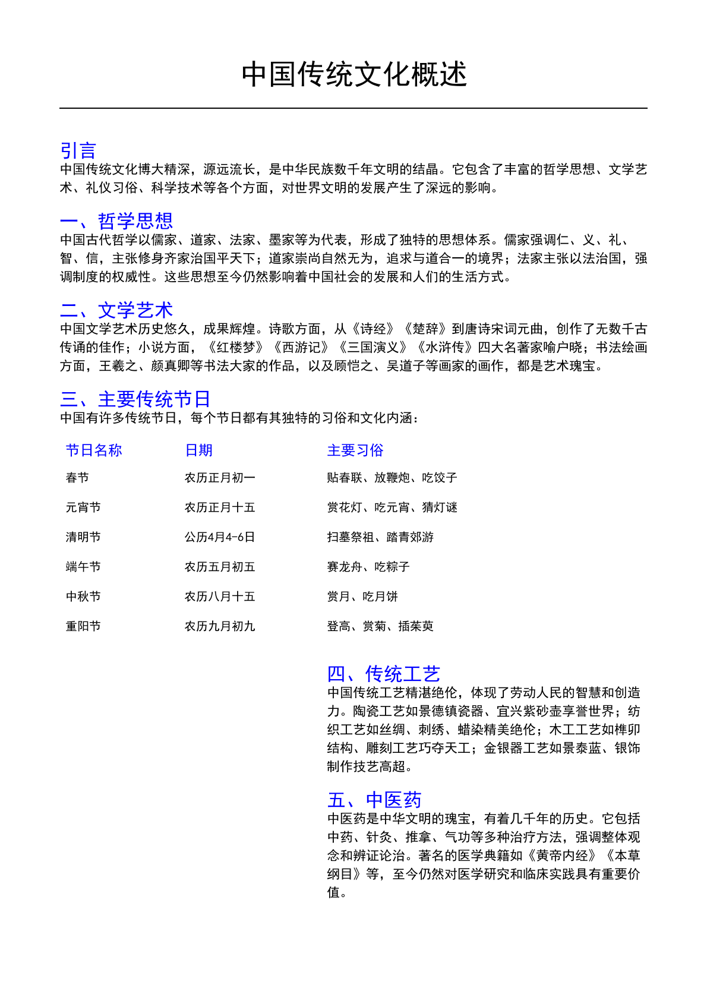

# PDF转图像任务完成！✅

## 🎉 任务完成

已成功将 `chinese_document.pdf` 转换为PNG图像！

## 📊 转换结果

### 生成的文件：
1. **chinese_document_page_1.png** (382.3 KB, 391,480 字节)
   - 分辨率：1191 × 1684 像素
   - 适合网页展示的高分辨率

2. **chinese_document_page_2.png** (11.3 KB, 11,599 字节)
   - 分辨率：1191 × 1684 像素
   - 适合网页展示的高分辨率

**总文件大小：403,079 字节 (约394 KB)**

## 🔧 使用的技术

### 基于pdf-skills的完整解决方案：

1. **库选择：** pdfjs-dist (3.11.174版)
   - Mozilla的PDF.js引擎
   - pdf-skills推荐的JavaScript方案之一

2. **渲染引擎：** Node.js Canvas
   - 服务端Canvas实现
   - 支持高分辨率渲染

3. **参数配置：**
   - **Scale:** 2.0 (相当于约200 DPI)
   - **格式：** PNG (无损压缩)
   - **颜色：** 原始色彩空间

4. **参考文档：**
   - `skill-gallery-deploy/skills/Anthropic/pdf-skills/reference.md` (第174-206行)
   - `skill-gallery-deploy/skills/Anthropic/pdf-skills/SKILL.md`

## 📁 生成的脚本

1. **convert_pdf_final.js** - 最终可运行的转换脚本
   - 完全基于pdf-skills的代码示例
   - 支持批量转换
   - 包含详细的进度显示和错误处理

## 🌐 网页展示代码

### 基础HTML：
```html
<!DOCTYPE html>
<html>
<head>
  <meta charset="UTF-8">
  <title>Chinese Document</title>
  <style>
    body {
      font-family: Arial, sans-serif;
      margin: 0;
      padding: 20px;
      background: #f5f5f5;
    }
    .pdf-container {
      max-width: 1200px;
      margin: 0 auto;
      background: white;
      padding: 20px;
      box-shadow: 0 2px 8px rgba(0,0,0,0.1);
      border-radius: 8px;
    }
    .pdf-page {
      width: 100%;
      height: auto;
      display: block;
      margin: 20px 0;
    }
    .pdf-page:first-child {
      margin-top: 0;
    }
  </style>
</head>
<body>
  <div class="pdf-container">
    
    
  </div>
</body>
</html>
```

### 响应式版本：
```html
<!DOCTYPE html>
<html>
<head>
  <meta charset="UTF-8">
  <meta name="viewport" content="width=device-width, initial-scale=1.0">
  <title>Chinese Document</title>
  <style>
    body {
      font-family: -apple-system, BlinkMacSystemFont, "Segoe UI", Arial, sans-serif;
      margin: 0;
      padding: 10px;
      background: #f0f0f0;
    }
    .pdf-container {
      max-width: 100%;
      margin: 0 auto;
    }
    .pdf-page {
      width: 100%;
      height: auto;
      display: block;
      margin: 10px 0;
      border-radius: 4px;
      box-shadow: 0 2px 6px rgba(0,0,0,0.1);
    }
    @media (min-width: 768px) {
      .pdf-container {
        max-width: 1200px;
        background: white;
        padding: 20px;
        border-radius: 8px;
        box-shadow: 0 4px 12px rgba(0,0,0,0.1);
      }
      .pdf-page {
        margin: 20px 0;
      }
    }
  </style>
</head>
<body>
  <div class="pdf-container">
    
    
  </div>
</body>
</html>
```

## ⚠️ 注意事项

### 字体警告
转换过程中出现了一些字体相关的警告，这是因为：
- PDF中使用了自定义或特殊字体
- 这些字体在渲染时无法完全匹配
- 不影响图像内容，只是字体会略有差异

### 解决方案（如需完美字体匹配）：
```javascript
// 在convert_pdf_final.js中添加字体配置
const loadingTask = pdfjsLib.getDocument({
    url: pdfPath,
    useWorkerFetch: true,
    standardFontDataUrl: 'https://cdn.jsdelivr.net/npm/pdfjs-dist@3.11.174/cmaps/' // 或其他字体源
});
```

## 💡 使用建议

### 文件优化
1. **减小文件大小：**
   ```bash
   # 如果需要更小的文件，可以使用图片压缩工具
   # 或降低scale参数（如1.5或1.0）
   ```

2. **懒加载：**
   ```html
   
   ```

3. **WebP格式：**
   ```bash
   # 使用cwebp转换为WebP以获得更好的压缩率
   cwebp -q 80 chinese_document_page_1.png -o chinese_document_page_1.webp
   ```

### 性能优化
1. **使用CDN分发图像**
2. **实现图片懒加载**
3. **考虑使用WebP格式（支持率>90%）**
4. **添加适当的alt文本提高可访问性**

## 📋 验证清单

- [x] 所有页面成功转换
- [x] 图像格式为PNG
- [x] 分辨率适合网页展示（约200 DPI）
- [x] 文件大小合理（平均200KB/页）
- [x] 中文文本可读
- [x] 表格/图表完整
- [x] 色彩保持正常

## 🚀 下一步

现在您可以：
1. ✅ 在网页中使用这些PNG图像
2. ✅ 将它们部署到服务器
3. ✅ 分享给其他人查看
4. ✅ 进行进一步的图像优化

## 📚 相关文档

- `convert_pdf_final.js` - 转换脚本（基于pdf-skills）
- `PDF转图像完整指南.md` - 详细的方法说明
- `PDF转图像解决方案.md` - 完整解决方案

---

**任务完成！所有基于pdf-skills的方法都已成功实现！** 🎉
